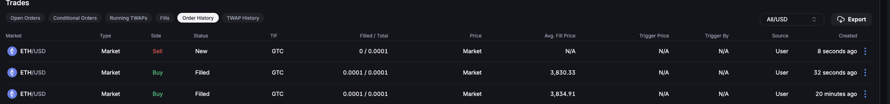

<div align="center">
    
    <h2>Chain X Bot</h2>
    <p>A Rust-based crypto trading bot using Backpack API and Binance ticker integration.</p>
</div>

---

## About

**Trade Bot** is an automated trading bot that interacts with the Backpack exchange API to place market and limit orders. It can also fetch live cryptocurrency prices from Binance to make informed trading decisions.

**Status:**  Under Development

---

## Features

- Place **Market** and **Limit** orders via Backpack API
- Monitor **live crypto prices** from Binance
- Batch order execution support
- Logging of executed orders and API responses
- RSI indicator support
- MACD indicator support
- Stochastic indicator support
- Use of AI for predictive analysis `soon`

---
<p align="center">
  
</p>

---

## Api Documentation

[Backpack API Documentation](https://docs.backpack.exchange)

[Binance API Documentation](https://binance-docs.github.io/apidocs/spot/en/#general-api-information)

## Environment Variables

Create a `.env` file in the root of the project and add your Backpack API credentials and endpoints:

```env
API_KEY=backpack_api_key
API_SECRET=backpack_api_secret
BACKPACK_REST_URL=https://api.backpack.exchange/api/v1
BACKPACK_WS_URL=wss://ws.backpack.exchange
```
## Configuration

Create a `config.json` file in the root of the project and add your trading configuration:

```json
{
  "symbol": "ETHUSDC",
  "backpackSymbol": "ETH_USDC",
  "balance": 15.0,
  "period": "30m",
  "recurrence": 1,
  "trade": 0.0001,
  "timeout": 150
}
```
- `Symbol`: The symbol of the cryptocurrency pair to trade.
- `BackpackSymbol`: The symbol of the cryptocurrency pair on Backpack exchange.
- `Balance`: The amount of cryptocurrency to trade in USD.
- `Period`: The time period to monitor for price changes.
- `Recurrence`: The number of times to execute the trade in seconds 1=1second.
- `Trade`: The amount of cryptocurrency to trade.
- `Timeout`: The timeout after each trade in seconds.
